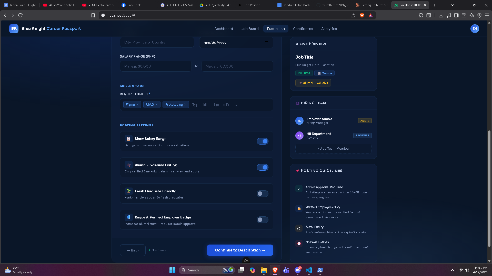
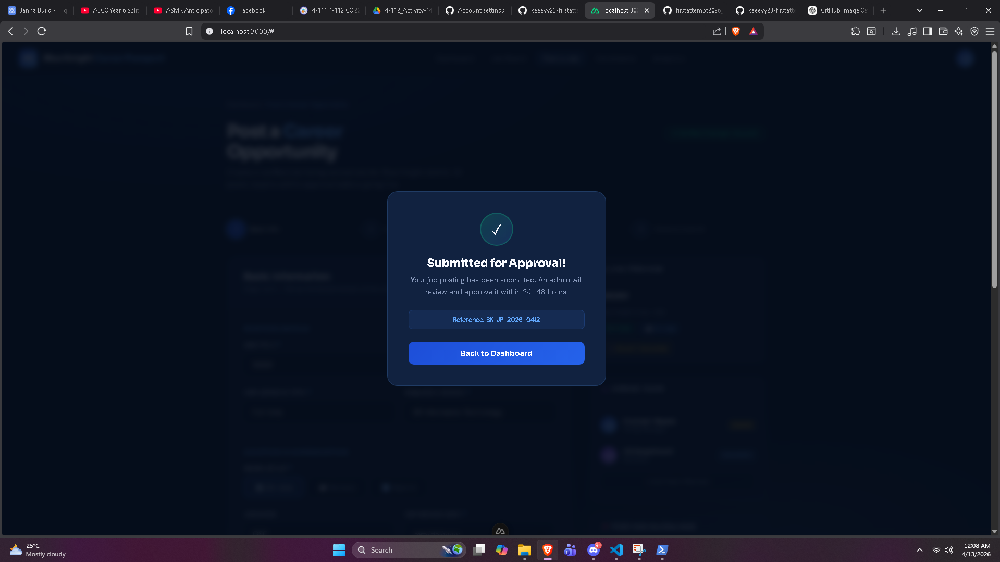

## Napala

#### Framework: Nuxt JS

#### Module: Module 4 - Job Posting

#### Installation

```bash
git clone https://github.com/keeeyy23/firstattempt2026_napala.git
cd firstattempt2026_napala
npm install
npm run dev
```

### AI Tools:
1. Claude 

### Prompt:
"Create a Job Posting web application using Nuxt JS for the Blue Knight Career Passport app. Include a form with Job Title, Employment Type, Required Degree, Work Setup toggles, Salary Range, Skills tags, Alumni-Exclusive toggle, and Submit for Admin Approval. Add a live preview sidebar and hiring team panel. Use a dark navy blue theme."

### Screenshots

**Screenshot 1 - Job Posting Form**


**Screenshot 2 - Full Page View**


**Screenshot 3 - Approval Confirmation**


