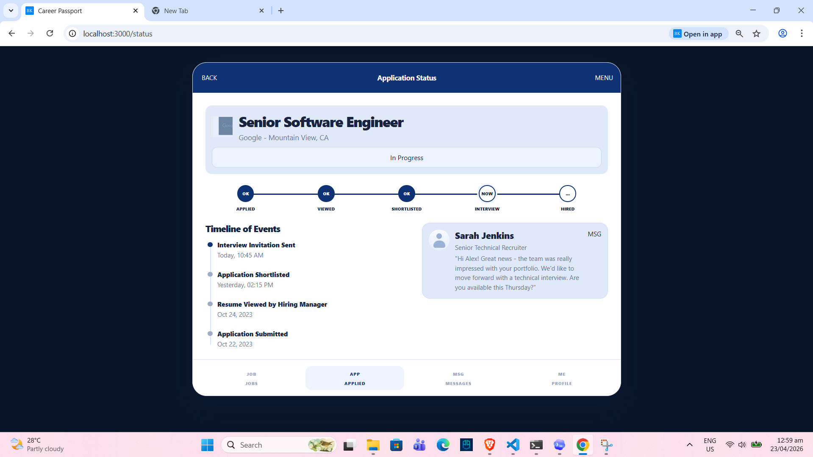
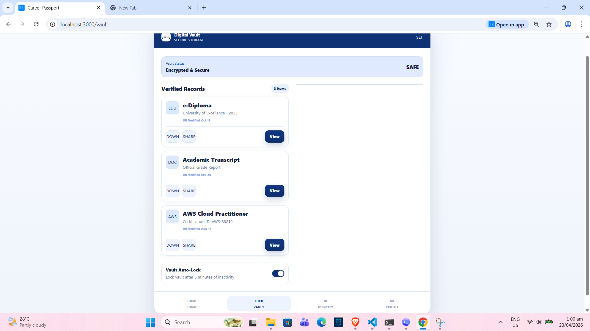

## Napala

#### Framework: Nuxt JS

#### Module: PWA Conversion

#### Installation

To replicate and run this project, follow these steps using Windows PowerShell:

```bash
git clone https://github.com/keeeyy23/firstattempt2026_napala.git
cd firstattempt2026_napala
npm install
npm run dev
```

For offline or PWA testing, use the production build and preview server instead of `npm run dev`:

```bash
npm run build
npm run preview
```

### AI Tools:

1. Claude
2. Chaptgpt (Codex)

### Prompt:

"this thing works, I want you to redesign all my design into this figma.pdf file that ill send please make the exact design as that given in my pdf file. and also ill be sending you the instruction. just ask me okay"

### Master Prompt:

"I am using Nuxt JS. Help me convert my existing static framework-based project into a high-performance, offline-ready Progressive Web Application for Activity 14. I need a valid manifest with university branding, service worker registration, caching for routes and images so the app works offline, and proper app icons. Keep the redesigned interface consistent with our earlier group activity output for the Career Passport screens."

### Hallucinations / Errors Fixed Manually:

1. The previous project content still included the old job posting structure, so the actual Nuxt pages had to be rebuilt to match the Career Passport group activity design.
2. Offline mode should not be tested in `npm run dev`; it should be tested from the production server after running `npm run build` and `npm run preview`.
3. The service worker and manifest were generated through the Nuxt PWA setup, so the working offline behavior had to be verified from the production `.output` build.
4. The screenshots were already stored in the `image` folder, so the README only needed to reference the existing files correctly.

#### Screenshots

https://github.com/keeeyy23/firstattempt2026_napala/tree/feature/pwa-ready
https://youtu.be/uo2BOW4rjXc

**Screenshot 1 - Login Screen**  


**Screenshot 2 - Job Search Screen**  


**Screenshot 3 - Instant Application Screen**  


**Screenshot 4 - Application Status Screen**  


**Screenshot 5 - Digital Vault Screen**  

